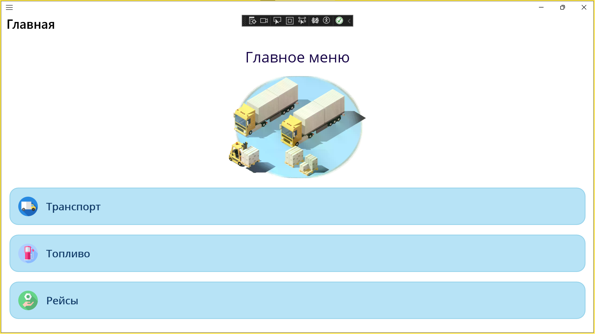
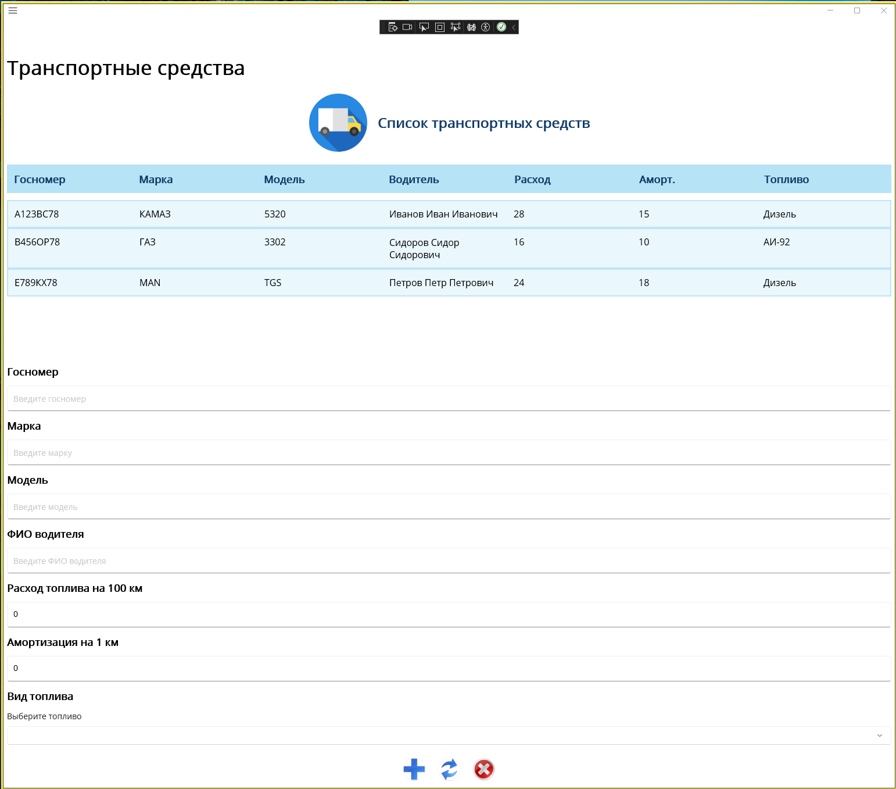
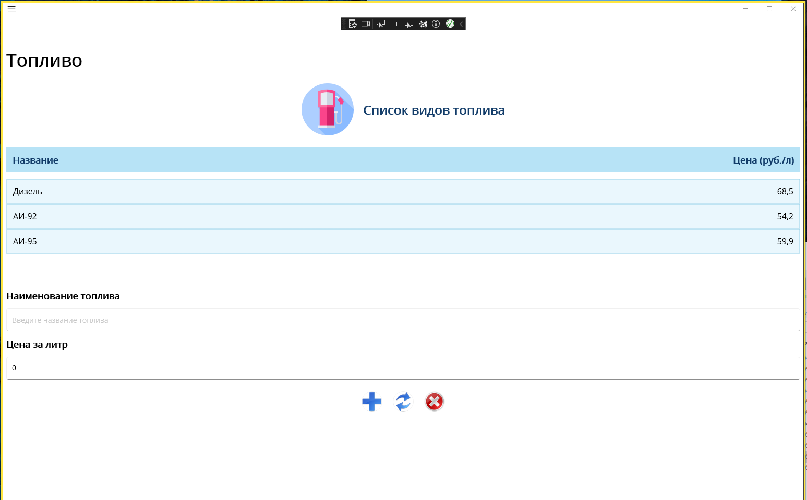
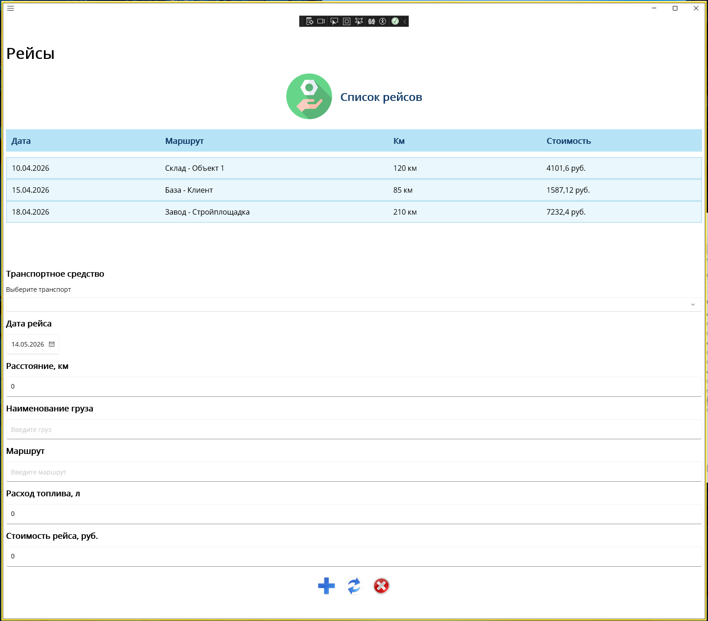

#  Информационная система автотранспортного предприятия 🚗

Desktop-приложение для управления автотранспортным предприятием, разработанное на **C#** и **.NET MAUI**.

---

##  О проекте

Проект представляет собой информационную систему для работы с транспортной компанией.

Приложение позволяет:
- управлять транспортом;
- работать с типами топлива;
- создавать поездки;
- рассчитывать расход топлива;
- рассчитывать стоимость поездок.

Проект выполнен в рамках учебной практики и демонстрирует навыки разработки desktop-приложений, работы с MVVM-архитектурой и организации структуры проекта.

---

## Используемые технологии

- C#
- .NET MAUI
- XAML
- MVVM
- ObservableCollection
- Repository Pattern

---

## Основной функционал

- Управление транспортом
- Управление видами топлива
- Создание поездок
- Автоматический расчёт расхода топлива
- Расчёт стоимости поездок
- Добавление, изменение и удаление данных
- Навигация между страницами
- Работа со списками и таблицами

---

## Структура проекта

```text
Pz2MauiApp/
├── Model/
├── ViewModel/
├── Repository/
├── Resources/
├── MainPage.xaml
├── VehiclePage.xaml
├── FuelPage.xaml
├── TripPage.xaml
└── AppShell.xaml
````

---

## Страницы приложения

* **Главная страница** — основная навигация
* **Страница транспорта** — управление транспортными средствами
* **Страница топлива** — работа с типами топлива и ценами
* **Страница поездок** — создание поездок и расчёт стоимости

---

##  Запуск проекта

1. Клонировать репозиторий:

```bash
git clone https://github.com/nvaysiz/maui-transport-system.git
```

2. Открыть проект в Visual Studio

3. Выбрать Windows target

4. Запустить проект

---


## 📷 Скриншоты

### Главная страница


### Страница транспорта


### Страница топлива


### Страница поездок



---


